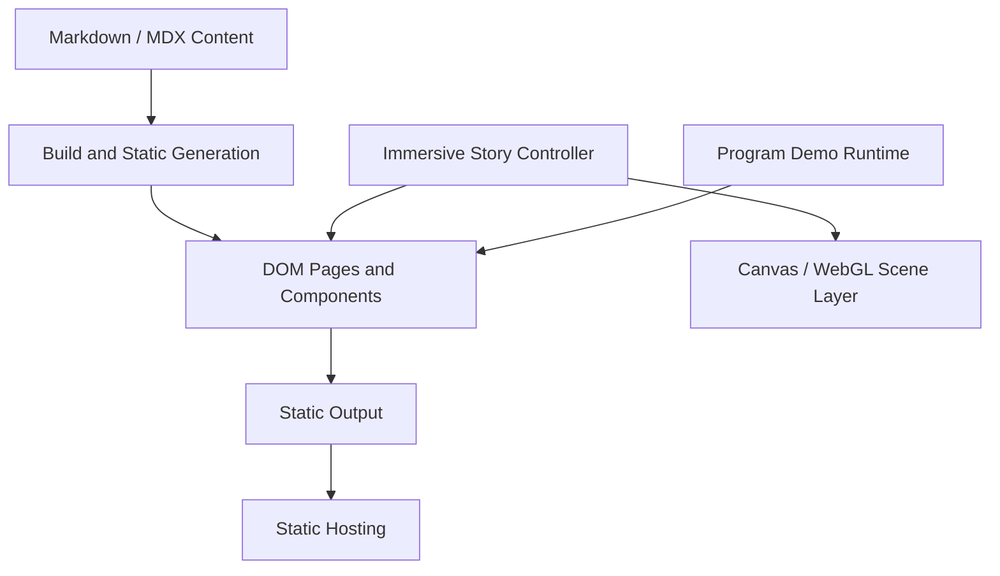

# 技术架构 Architecture

版本：1.0.0  
状态：目标架构  
当前实现说明：现有项目据 Codex 汇报采用 vinext/React，但静态导出能力尚未独立验证。

## 1. 架构目标

- 静态部署；
- 内容易维护；
- 沉浸式滚动；
- 程序演示隔离；
- 可访问、可降级、可测试；
- 不让动画代码污染文章和程序内容。

## 2. 逻辑分层



### 内容层

文章、程序、个人信息、标签和媒体引用。

### 页面层

导航、文章列表/详情、程序列表/详情、关于我、SEO 和可访问 DOM。

### 叙事控制层

读取统一滚动进度，映射全局阶段，控制 DOM 内容状态并通知场景层。

### 场景层

陆地、下潜、深海、海洋到星空、星空、粒子、视差和画质降级。

### 程序演示层

站内静态演示、iframe 沙箱、外部演示、媒体演示和错误边界。

### 构建部署层

静态路由生成、资源压缩、sitemap、404、子路径和部署输出。

## 3. 当前框架策略

现有实现据报告使用 vinext/React。当前决策：

1. 不因原建议是 Astro 就自动重构；
2. 先执行静态导出审查；
3. 若当前框架能稳定生成全部静态页面，则保留；
4. 若动态路由无法预生成或必须常驻 Node，再提出迁移；
5. 框架迁移必须通过 ADR。

详见 `docs/adr/0002-current-framework-static-export-gate.md`。

## 4. 推荐源码结构

应根据现有仓库适配，不要求机械复制：

```text
app/
├─ config/
│  ├─ site.config.ts
│  ├─ story.config.ts
│  └─ quality.config.ts
├─ content/
│  ├─ articles/
│  └─ programs/
├─ components/
│  ├─ common/
│  ├─ articles/
│  ├─ programs/
│  └─ home/
├─ scenes/
│  ├─ core/
│  ├─ overworld/
│  ├─ underwater/
│  ├─ space/
│  └─ transitions/
├─ demos/
│  ├─ registry.ts
│  ├─ shells/
│  └─ shared/
├─ routes-or-pages/
├─ styles/
└─ utils/
```

## 5. 内容模型

```ts
type Article = {
  slug: string;
  title: string;
  description: string;
  publishDate: string;
  updatedDate?: string;
  cover?: string;
  tags: string[];
  featured: boolean;
  draft: boolean;
};

type ProgramStatus =
  | "completed"
  | "in-progress"
  | "prototype"
  | "archived";

type DemoType =
  | "static-embedded"
  | "external-live"
  | "video"
  | "gif"
  | "screenshots"
  | "none";

type Program = {
  slug: string;
  title: string;
  summary: string;
  status: ProgramStatus;
  category: string;
  stack: string[];
  tags: string[];
  cover?: string;
  featured: boolean;
  order?: number;
  demoType: DemoType;
  demoUrl?: string;
  sourceUrl?: string;
  limitations?: string[];
  ownerContribution: string[];
};
```

完整规则见 `docs/product/content-model.md`。

## 6. 路由生成

构建时收集所有公开文章 slug、所有公开程序 slug、固定页面和兼容旧路由，并生成等价的静态文件。

若部署在 GitHub Pages 子路径，统一处理 base path、asset prefix、canonical、内部链接和图片路径。

## 7. 首页滚动架构

首页只允许一个主进度来源：

```ts
type StoryProgress = number; // 0..1
```

统一配置：

```ts
const storySections = {
  overworld: [0.00, 0.30],
  dive: [0.30, 0.38],
  underwater: [0.38, 0.66],
  oceanToSpace: [0.66, 0.80],
  space: [0.80, 1.00],
} as const;
```

映射函数：

```ts
function localProgress(globalProgress: number, start: number, end: number) {
  return Math.min(1, Math.max(0, (globalProgress - start) / (end - start)));
}
```

各场景不能自行注册互相冲突的全局滚动监听。

## 8. 场景接口

```ts
interface Scene {
  init(): Promise<void>;
  update(progress: number, deltaMs: number): void;
  resize(viewport: Viewport): void;
  setQuality(level: QualityLevel): void;
  setReducedMotion(enabled: boolean): void;
  destroy(): void;
}
```

场景必须可安全销毁，资源失败时可降级。

## 9. Canvas 与 DOM 边界

Canvas：背景、云、山、海水、鱼、气泡、海草、浪花、星点、星云和粒子。

DOM：标题、摘要、文章与程序文字、按钮、标签、导航、联系方式和错误提示。

通过统一 story progress、场景状态和 CSS 变量协调。

## 10. 程序演示架构

### 模式 A：站内静态组件

适合纯前端工具、算法演示和可视化。

### 模式 B：站内 iframe

适合需要独立样式、脚本和存储隔离的程序。

### 模式 C：外部链接

适合有独立后端或体积过大的程序。

### 模式 D：媒体演示

适合视频、GIF 和截图。

推荐注册表：

```ts
type DemoRegistration = {
  programSlug: string;
  mode: "component" | "iframe" | "external" | "media";
  entry?: () => Promise<unknown>;
  url?: string;
  sandbox?: string;
};
```

## 11. 错误边界

处理内容字段缺失、演示加载失败、WebGL 不可用、Canvas context lost、图片失败、资源路径错误、动态路由不存在、低性能设备、Reduced Motion 和 iframe 被阻止。

错误不能导致整页白屏、导航不可用、无限 Loading 或正文消失。

## 12. 性能架构

- 首屏陆地优先加载；
- 深海接近阶段时预加载；
- 星空后台或接近阶段时加载；
- 程序演示进入详情或点击体验时加载；
- 画质分为 high、medium、low、static；
- DPR 最大 2；
- 页面隐藏暂停；
- 粒子池复用并使用固定种子。

## 13. 测试边界

单元测试：内容校验、进度映射、阶段判定、DemoRegistry 和路由生成。

集成测试：文章/程序列表到详情、演示失败、旧路由兼容、Reduced Motion 和静态输出。

E2E：首页完整滚动、反向滚动、移动端、详情刷新、导航、404、键盘和控制台错误。

## 14. 架构变化流程

更换框架、引入 SSR/后端、改变内容源、改变演示隔离方式、改变核心路由、替换滚动架构或改变部署约束时必须新增 ADR。
