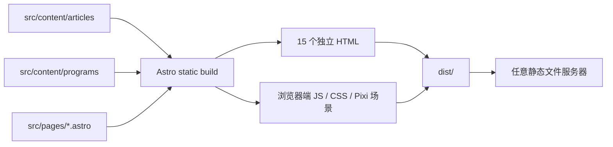

# 技术架构 Architecture

版本：1.9.2

状态：M6 回归修复已实施并完成正式验收

对账日期：2026-07-22
验证基线：Sites 源码仓库的 `3cd17db` 是“迁移到静态 Astro 世界”的提交，包含 Astro 配置、`src/pages/`、内容集合和静态导出测试。本地 Vibe Coding 文档最初位于另一条 Git 历史，因此首次对账时无法解析该提交；发布准备阶段只读获取 Sites 历史后已完成核对。本文结论同时采用 `3cd17db`、当前实现、实际构建和静态服务器结果。

## 1. 当前结论

当前项目已经完成 Astro 迁移，并采用 Astro 的纯静态输出模式：

- Astro 5.18.2 负责路由、内容集合、构建和静态 HTML 生成；
- React 19.2.6 仅用于需要交互的客户端组件；
- PixiJS 8.8.1 与 GSAP 3.13.0 用于首页沉浸式场景；
- Markdown/MDX 内容在构建期读取；
- 默认输出目录是 `dist/`；
- 生产输出不要求常驻 Node 服务端；
- 内容领域已经迁移为 `Program/programs`，`Project/projects` 只保留旧 URL 兼容层。

## 2. 已验证技术栈

| 层级 | 当前实现 | 证据 |
| --- | --- | --- |
| 框架 | Astro 5.18.2 | `package.json`、`npm ls --depth=0` |
| UI | Astro 组件 + React 19.2.6 island | `src/pages/`、`src/components/` |
| 内容 | Astro Content Collections + Markdown/MDX | `src/content.config.ts`、`src/content/` |
| 场景 | PixiJS 8.8.1 + GSAP 3.13.0 | `src/interactive/` |
| 构建模式 | `output: "static"`、`build.format: "directory"` | `astro.config.mjs` |
| 类型检查 | Astro Check + TypeScript 5.9.3 | `npm run typecheck` 通过 |
| 质量检查 | ESLint + Node test runner | `npm run lint`、`npm test` 通过 |

## 3. 实际构建与请求链路



页面正文、导航、链接、搜索筛选和可访问信息由真实 DOM 承载。首页交互组件在浏览器水合后启动 SceneController；静态 HTML 本身不依赖 Node 请求期渲染。

## 4. 实际源码边界

```text
src/
├─ components/              # Astro/React DOM 组件
├─ config/                  # 站点与滚动阶段配置
├─ content/
│  ├─ articles/             # 当前文章内容
│  └─ programs/             # 本人编写的程序、工具和交互实验
├─ interactive/
│  ├─ SceneController.ts    # 单一滚动进度与场景协调
│  ├─ scenes/               # 陆地、深海、星空
│  └─ transitions/          # 下潜、海洋到星空
├─ layouts/                 # 页面布局
├─ lib/                     # 内容读取与排序
├─ pages/                   # Astro 文件路由
├─ styles/                  # 全局与响应式样式
└─ types/                   # Article/Program 领域类型
```

## 5. 静态路由生成

`src/pages/articles/[slug].astro` 和 `src/pages/programs/[slug].astro` 使用 `getStaticPaths()` 在构建期枚举主内容；`src/pages/projects/[slug].astro` 使用同一 Programs slug 集合生成兼容跳转页。当前 `npm run build` 生成以下 15 个 HTML：

| URL 路由 | 静态文件 | 来源 |
| --- | --- | --- |
| `/` | `dist/index.html` | `src/pages/index.astro` |
| `/about/` | `dist/about/index.html` | `src/pages/about.astro` |
| `/articles/` | `dist/articles/index.html` | 文章列表 |
| `/articles/content-as-levels/` | `dist/articles/content-as-levels/index.html` | 文章内容集合 |
| `/articles/first-post/` | `dist/articles/first-post/index.html` | 文章内容集合 |
| `/articles/small-tools/` | `dist/articles/small-tools/index.html` | 文章内容集合 |
| `/programs/` | `dist/programs/index.html` | “做点啥呢”主列表 |
| `/programs/pixel-journey/` | `dist/programs/pixel-journey/index.html` | Program 内容集合 |
| `/programs/signal-garden/` | `dist/programs/signal-garden/index.html` | Program 内容集合 |
| `/programs/tidy-desk/` | `dist/programs/tidy-desk/index.html` | Program 内容集合 |
| `/projects/` | `dist/projects/index.html` | 指向 `/programs/` 的兼容页 |
| `/projects/pixel-journey/` | `dist/projects/pixel-journey/index.html` | 指向同 slug Program 的兼容页 |
| `/projects/signal-garden/` | `dist/projects/signal-garden/index.html` | 指向同 slug Program 的兼容页 |
| `/projects/tidy-desk/` | `dist/projects/tidy-desk/index.html` | 指向同 slug Program 的兼容页 |
| `/404.html` | `dist/404.html` | `src/pages/404.astro` |

静态服务器逐一请求上述 15 个 URL 均返回 HTTP 200，未知路由返回 HTTP 404。兼容页通过 meta refresh、`window.location.replace` 和无脚本链接跳转，并使用 `noindex,follow` 与新 canonical。Sitemap 只收录主 Programs 路由，不收录 Projects 兼容页。

## 6. 静态输出与运行时边界

默认构建命令 `npm run build` 的唯一正式输出是 `dist/`。验证结果：

- `dist/server` 不存在；
- `dist/` 中没有 `.cjs`、`.mjs` 或 `.node` 服务端运行时文件；
- 没有 Astro 服务端 adapter；
- `src/pages/robots.txt.ts` 虽使用 `APIRoute` 类型，但显式 `prerender = true`，在构建期生成静态 `robots.txt`；
- Node.js 只用于安装依赖、开发、构建、适配和测试，不是网站请求期依赖。

`npm run build:sites` 会在默认 Astro 构建后执行 `scripts/build-sites-adapter.mjs`，生成单独的 Sites 部署包。该包中的 Worker 仅转发静态资源，不改变核心 `dist/` 的纯静态性质，也不是 Node 服务端运行时。

## 7. 子路径部署

`astro.config.mjs` 通过 `SITE_URL` 和 `BASE_PATH` 统一控制站点地址和 base path。本次以：

```text
SITE_URL=https://example.github.io
BASE_PATH=/pixel-walk-audit
```

重新构建并用纯静态服务器验证。11 个带前缀路由及抽查的 CSS 资源均返回 HTTP 200；内部链接、资源地址和 canonical 均带 `/pixel-walk-audit` 前缀。

## 8. 当前 Program 内容模型

当前代码事实：

- `src/content.config.ts` 注册 `articles` 与 `programs`；
- `src/types/content.ts` 定义 `ProgramSummary`、`ProgramStatus`、`DemoType` 与隐私结构；
- `src/lib/content.ts` 使用 `CollectionEntry<"programs">`；
- 内容存放在 `src/content/programs/`；
- 主路由是 `/programs` 与 `/programs/[slug]`；
- 每项 Program 必须包含本人贡献、限制、隐私、演示类型和详情页八个固定内容区块；
- `static-embedded` 条目显示静态演示能力边界，不伪造后端、数据库、登录或实时能力。

完整维护规则见 `docs/product/content-model.md`，领域与路由决策见 ADR 0009。

## 9. 首页交互架构

首页只有一个全局滚动进度源。阶段范围由 `src/config/story.config.ts` 定义，`src/interactive/SceneController.ts` 将全局进度映射为陆地、下潜、深海、海洋到星空和星空的局部进度。

场景层不直接承载核心文本或链接：

- Canvas/Pixi：天空、山、海水、鱼、气泡、海草、浪花、星点、星云和粒子；
- DOM/React：标题、摘要、文章与 Program 入口、按钮、导航、关于信息和页脚；
- Canvas 世界层与 DOM 层始终保持水平；海洋到星空只通过透明度、颜色、光束和粒子形态连续过渡，不旋转或翻转任何背景世界；
- Reduced Motion 与移动端通过独立分支降低粒子和动画强度，但所有模式下世界方向均固定为 0°。

DOM 内容层继续保持在 Canvas 之上以保证正文、链接和降级内容可用，但内容层必须遵守场景安全区：陆地 Hero 使用响应式顶部安全偏移；文章标题、路牌组顶部、卡片高度、错层距离和路牌柱长度使用一组 CSS 安全区参数，为位于 `0.73 × viewportHeight` 地面线附近的旅行者保留走廊。`≤980px` 时三张路牌切换为容器内横向轨道并隐藏装饰柱，不制造页面级横向溢出。Programs 标题、三张档案终端和总入口使用顺序文档流与显式 gap，不再使用按索引错开的 sticky 堆栈。完整与简化模式复用同一套无碰撞内容结构，模式只改变既有阶段高度与动画分支。

当前实现按绝对进度确定性重绘。M4 已完成 50%→30% 的深海倒放，M4.5 已完成 38%→30% 的陆海翻涌倒放和 Reduced Motion 往返帧一致性验收。需求更正后的 M4.5 还负责取消背景世界旋转：`SceneController` 全程强制 `world.rotation = 0`，原先按正弦曲线计算的桌面/移动端最大旋转已删除。M5 继续沿用固定方向约束，并把海空气泡、星点与流星改为同一个固定种子粒子池；所有形态、位置、Programs 退出和 About 进入均由绝对 `globalProgress` 计算，82%→64% 同页倒放可恢复深海状态而不重新随机。

陆地世界的视差参数统一位于 `STORY_CONFIG.overworld.parallax`。配置通过 `maxTravel` 和远景、中景、近景、前景四层强度表达整体深度关系，并集中维护山、云、丘陵、路径、花朵和尘粒的层内倍率；`OverworldScene` 不再保存未说明的视差系数。四层有效位移保持在迁移前约 `0.07 / 0.19 / 0.40 / 0.54` 的范围，浏览器 0%、25% 与反向回滚验收未发现明显视觉退化。

`SceneController` 使用初始化状态守卫保护 `resize()` 和提前销毁路径，避免响应式视口切换或页面重载早于 Pixi renderer 初始化时访问未就绪的 renderer。该守卫不改变单一进度源或场景绘制结果。

M4/M4.5 的细分时间线、陆海翻涌参数、深海层级和尾段预热统一位于 `STORY_CONFIG.dive` 与 `STORY_CONFIG.underwater`：

- `getLandOceanTransitionState(globalProgress)` 将 `0.300–0.380` 映射为 cooling、farWave、waveApproach、waveBreak、foamCover 和 underwaterSettle，`getDiveState()` 在此基础上继续驱动 `0.380–0.430` 的 surfaceRetreat；Canvas 水线与 DOM 折射带共同读取同一状态；
- `STORY_CONFIG.dive.waves` 继续维护远浪、中浪、前浪的原进度与基础层参数；M5.5 在 `STORY_CONFIG.m55.waveSprites` 集中维护三张生产 sprite、两条横向泡沫带和一张竖向气泡簇的高度、相位、速度、透明度和移动端参数。`DiveTransition` 仍是唯一陆海浪花实现：标准动效优先用独立 `TilingSprite` 层定义轮廓，Graphics 只负责水体填充、少量补充泡沫和素材解码失败降级，不与 M5 的 `OceanToSpaceTransition` 共用实现；
- `DiveTransition` 使用 96 项固定泡沫数据池与单一复用 Graphics，向前和向后滚动均只由绝对进度重绘；375px 使用 `0.72` 细节倍率、`0.38` 泡沫倍率并取消薄雾，Reduced Motion 只绘制单层静态像素浪幕；
- `SceneController` 在完全入水阶段对陆地容器应用冷色 tint、低对比透明度、向上位移和轻微缩小，所有值只由全局进度计算，向上滚动时原路恢复；
- `STORY_CONFIG.underwater.parallax` 明确区分远景、中景、近景、前景，`UnderwaterScene` 不再保存未说明的深海视差位移；鱼群与水母使用模块级固定池，气泡则由跨 M4/M5/M6 的统一 `MorphParticle` 池持有；
- `STORY_CONFIG.oceanToSpace` 集中维护 `0.640–0.800` 的 preheat、bubbleDensity、brighten、bubbleToStar、starToMeteor 和 settleSpace 六段时间线，以及 180 项粒子上限、密度、流数量、流星比例、尾迹和颜色参数；`getOceanSpaceMorphState()` 是 Canvas 与 DOM 的共同纯函数；
- `src/interactive/transitions/morphParticles.ts` 使用固定种子 `0x50495845` 一次性生成 180 项 `MorphParticle`；每项同时保存 ocean、star、meteor 目标与稳定身份。`UnderwaterScene` 不再持有独立 88 项气泡池，`SpaceScene` 不再持有独立 240 项星点或程序化流星；
- `OceanToSpaceTransition` 复用五个 `Graphics` 绘制颜色、银河、流引导、尾迹和统一粒子，不按帧创建粒子对象。桌面使用三股上升流、最大 `5.5%` 流星；375px 使用两股流、`0.86` 粒子密度倍率和最大 `2.2%` 流星；Reduced Motion 不绘制流引导与流星；
- M5.5 保留上述固定流星的数量、身份、终点和原视差关系，只把最终轨迹修正为左上到右下、拖尾放在头部左上。独立 `MeteorOverlay` 是位于 Pixi Canvas 之上、DOM 内容之下的 fixed Canvas；它只接收 `phase === "space"` 激活布尔值，不接收或读取滚动进度。参数集中为经所有者实际试用确认的 `1–3s` 间隔、`300–900ms` 生命周期、桌面最多 2 颗、移动端最多 1 颗；离开星空、页面隐藏、Reduced Motion 或组件 cleanup 都会清除 timer、RAF 和活动实例；
- 右上行星仍由 `drawPlanet()` 在 `SpaceScene.nearDecor` 中绘制，但 M5.5 将其拆为像素环境散射、外扩散层、内亮层、后半环、核心主体和前半环。各层读取 `STORY_CONFIG.m55.planetHalo`，不使用大范围 blur，也不新增 DOM 装饰层；
- M4.5 的三层浪由 `DiveTransition` 独立负责并在入水前结束，M5 不再持有旧的三层浪、独立泡沫种子或银河线实现。水下光束只以像素块坐标与透明度连续成为银河，不旋转世界、场景或粒子容器；
- `ImmersiveHome` 读取同一 morph 状态写入 Programs/About 的透明度和局部位移变量；Programs 完全退出后只切换 `visibility` 与 `pointer-events`，不改变文档流高度，因此没有内容突跳；
- Programs 档案由真实 DOM 承载，首页卡片显示状态、演示类型、技术栈、当前限制和链接，保持“本人编写的程序”语义；
- 非 canonical 的 `?motion=full|reduce` 是当前页面临时覆盖，`?canvas=fallback` 用于稳定复现 Canvas 初始化失败边界；它们不新增路由、不进入 Sitemap。URL 动效覆盖不写入保存值，用户从控件切换时移除 `motion` 参数并保留其他查询参数。

### M6 已完成：统一动效模式入口与回归修复

M6 没有创建第三套场景实现。`BaseLayout.astro` 的 head 内联引导脚本在 React、Pixi、GSAP 和动态流星启动前解析一个统一的 `full | reduce` 状态；`useMotionPreference` 负责客户端订阅、持久化和系统建议，现有场景与 Reduced Motion 分支共同消费最终状态。解析顺序固定为 `?motion=full|reduce` 临时覆盖、用户本地保存选择、产品默认 `full`。`prefers-reduced-motion` 仍被检测并在 fixed UI 中给出简化建议，但不自动覆盖产品默认值。

实现边界如下：

- `MotionModeControl` 位于 fixed UI，不进入 Pixi 场景树或滚动 transform 容器，使用原生按钮、`aria-pressed`、44px 触控目标和可见焦点；
- URL 临时覆盖不写入本地存储；用户从控件切换时保存选择并退出临时覆盖；
- 已保存简化模式在 Pixi、GSAP、`MeteorOverlay` 和其他非滚动时间动画启动前生效；存储失败时使用当前会话状态且不抛出未处理错误；
- `SceneController`、CSS 和 `MeteorOverlay` 不再分别读取系统媒体查询，而是消费统一模式；切换只协调现有实例，动态流星 effect cleanup 继续清理 RAF、timer 与 visibility listener；
- 模式切换记录活动触发器的 `globalProgress`，使用 revision 标识取消旧 RAF/坐标恢复；新布局最多观察 12 帧并要求连续 4 帧边界稳定，再刷新当前唯一 ScrollTrigger，按该实例的 start/end 映射等价坐标。ScrollTrigger end 显式读取 `story.offsetHeight - innerHeight`，不再用页面总高度代替故事范围；
- 当前 `globalProgress`、M3～M5.5 区间、桌面/移动阶段高度、内容 DOM、路由、Sitemap、Canvas fallback 和 0° 世界方向全部保持不变；
- 默认保存键为 `pixel-walk:motion-preference`；HTML 根节点记录 `data-motion-mode`、`data-motion-source` 和 `data-system-motion`，便于 CSS、组件与验收读取同一状态。

M6 回归修复的实际架构：

- 每次模式切换生成唯一事务标识；新切换立即取消并使旧 RAF/refresh/坐标恢复失效，`data-motion-restoring` 只标记当前有效事务的生命周期；
- `src/lib/storyScroll.ts` 提供可测试的进度夹取、progress→scrollY 与 scrollY→progress 纯函数；模式开关和章节节点读取同一个活动触发器边界；
- 新模式布局稳定后刷新唯一 ScrollTrigger，读取该实例实际 start/end，并用同一个 `globalProgress` 映射新坐标；恢复误差超过 `0.01` 时再次刷新并校正；
- 物理底部强制对应 `globalProgress >= 0.999` 与 `phase=space`，且可反向回到 0%；实现没有禁用默认滚动、增加 pin、整页吸附或第二条时间线；
- `.constellation-links` 复用既有前两篇文章和前两个 Program DOM，桌面完整/简化均为左侧四行常显列表，层级为 `z-index: 4`；375px 取消信号站 sticky，列表进入信号站后的正常文档流；
- 星空入口修复只调整 DOM 内容层布局与状态样式，不修改 M5.5 的 Canvas 星空、行星光环、固定/动态流星或 M5 的进度区间。

## 10. 验证门禁

本次 M4.5 验收实际执行：

```text
npm run check
npm run lint
npm test
npm run build:sites
```

最新 M4.5 验收结果为：生产构建成功并生成 15 个静态 HTML，Astro Check 为 0 errors / 0 warnings / 0 hints，lint 通过，9 项静态输出与源码边界测试全部通过；其中新增回归测试确认 `world.rotation` 固定为 `0`，且旧 `maxRotation`/正弦旋转公式不再存在。纯静态服务器逐一验证 11 个主页面和 4 个 Projects 兼容页为 HTTP 200，未知路由为 404，`dist/server` 不存在。

2026-07-18 内容层碰撞回归修复后再次执行相同门禁：Astro Check 仍为 0 errors / 0 warnings / 0 hints，lint 通过，静态输出与源码边界测试增至 10 项且全部通过；生产构建仍为 15 个 HTML，纯静态服务器验证 15/15 个主/兼容页面为 HTTP 200、未知路由为 HTTP 404，`dist/server` 仍不存在。新增测试锁定 Hero 与文章路牌安全区、短视口和窄屏路牌降级、旅行者路径不变、Programs 非 sticky 顺序流及 `?motion=full` 的桌面/移动端阶段高度。

2026-07-18 M5 正式验收继续执行相同门禁：Astro Check 为 0 errors / 0 warnings / 0 hints，lint 通过，测试增至 11 项且 11/11 通过，`npm run build:sites` 成功；`dist/` 仍为 15 个 HTML，静态服务器验证 15/15 路由为 HTTP 200、未知路由为 HTTP 404、`dist/server` 不存在。新增回归测试锁定统一固定粒子池、M5 无 `Math.random`、深海与星空不再持有独立气泡/星点/流星池、旧 M5 三层浪已移除，以及世界方向固定为 0°。

2026-07-18 M5.5 视觉抛光在不改变上述 M5 时间线的前提下完成：Astro Check 为 0 errors / 0 warnings / 0 hints，lint 通过，测试增至 12 项且 12/12 通过，`npm run build:sites` 成功；6 个透明生产 sprite 以 `10.44–21.35kB` 哈希 PNG 进入静态输出，`dist/` 仍为 15 个 HTML。纯静态服务器验证 15/15 路由为 HTTP 200、未知路由为 HTTP 404、`dist/server` 不存在。新增测试锁定固定流星方向、动态流星与滚动解耦及 cleanup、生产 sprite 接入、行星光环层次，以及 `dive/oceanToSpace/space` 原区间不变。

2026-07-22 M6 统一动效模式入口完成：Astro Check 为 0 errors / 0 warnings / 0 hints，ESLint 通过，测试增至 13 项且 13/13 通过；`npm run build` 生成 15 个静态 HTML，纯静态服务器验证 15/15 页面为 HTTP 200。浏览器在系统 Reduced Motion 环境确认裸地址仍为 `full/default` 并显示简化建议；保存、刷新、站内跳转、URL 临时覆盖、Canvas fallback、375×812 和控制台均通过。星空 80.0073% 处完整↔简化双向切换进度差为 0，动态流星运行状态 `true→false→true`，始终为 1 个 overlay 与 2 个 Canvas。

上述 13 项 M6 记录是初次验收历史；项目所有者随后提供的生产截图证明单点 80% 没有覆盖偶发滚动死区，并暴露星座标题只在 hover/focus 显示的回归，因此曾撤回 M6-13、M6-15。

2026-07-22 M6 最终回归修复完成：64%、72%、76%、79%、80%、82%、90% 的 full→reduce 与 reduce→full 最大误差为 `0.0002`，每点均可到 `progress=1 / phase=space` 并回到 0；连续 5 轮快速切换后保持 `full / 0.8001`，误差 0。完整/简化触发器 end 均与当前 story end 相等。桌面 90% 恢复四项常显入口；375px 的信号站与列表重叠为 0、无横向溢出；Canvas fallback 保留四项内容，Program 链接可聚焦并到达详情页，新建完整/fallback 标签页控制台 warn/error 均为空。Astro Check、ESLint、14/14 测试与 `npm run build:sites` 通过，仍生成 15 个静态 HTML。

M5 浏览器验收在 1280×720 下逐一命中 64%、66%、69%、72%、75.5%、78.5%、80% 和 82%，并在同一页面完成 82%→64% 倒放；375×812 的 72%/78.5% 无横向溢出并降低流星比例；Reduced Motion 的 78.5% 取消流星和时间抖动；Programs 与 About 链接均可见、可用、可聚焦。最终代码的新页面及五次海空往返后的浏览器 warn/error 均为空，DOM 节点数、Canvas 数和 story root 数在五次循环中分别恒为 `260/1/1`。

M5.5 浏览器验收覆盖 1280×720 的约 35% 三层浪和 82% 星空、1920×1080 的 35% 横向接缝、375×812 浪花与星空，以及系统 Reduced Motion 的 80%。桌面星空观察到独立高速流星实例；82%→72%→82% 时 overlay 运行状态为 `true→false→true`，始终只有 1 个 overlay、2 个 Canvas。375px 与 1920px 的页面横向溢出测值均为 `-15px`；Reduced Motion 下 overlay 为 `running=false`、实例数 `0`；所有浏览器状态的 warn/error 均为空。

浏览器在 1280×720 标准动效下逐一验证 31.5%、32.8%、34.2%、35.0%、35.8%、36.8% 和 38.0%，并完成 38%→30% 倒放；在 375×812 下复验 31.5%、35.8%、38.0%、无正向横向溢出和链接可用；Reduced Motion 的 35.8% 间隔 700ms 两帧摘要及 38%→30%→35.8% 往返帧摘要一致；Canvas 强制降级时文章与 Programs DOM 仍完整。文章入口指针点击进入真实详情，Programs 导航指针点击进入 `/programs`，二者均 `tabIndex=0` 且可获得焦点；标准、Reduced Motion、移动端和降级状态的浏览器 warn/error 均为空。

## 11. 已知未完成项

- DemoRegistry 与程序演示隔离层尚未实现；
- 当前 `static-embedded` 只提供静态说明；真正的独立演示容器和按需加载由 M7 跟踪；
- M3 陆地视差、M4 下潜/深海、M4.5 陆海翻涌、M5 气泡到繁星/流星、M5.5 视觉抛光和 M6 星空/动效模式均已完成正式验收；下一未完成阶段为 M7 程序演示系统。

## 12. 架构变化流程

更换框架、引入 SSR/后端、改变内容源、改变演示隔离方式、改变核心路由、替换滚动架构或改变部署约束时，必须新增 ADR。当前 Astro 静态架构的接受结论记录在 `docs/adr/0002-current-framework-static-export-gate.md`。
