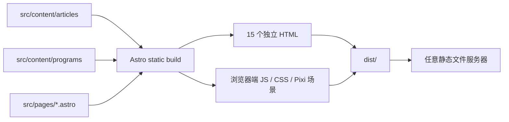

# 技术架构 Architecture

版本：1.3.0

状态：当前已验证架构

对账日期：2026-07-17
验证基线：Sites 源码仓库的 `3cd17db` 是“迁移到静态 Astro 世界”的提交，包含 Astro 配置、`src/pages/`、内容集合和静态导出测试。本地 Vibe Coding 文档最初位于另一条 Git 历史，因此首次对账时无法解析该提交；发布准备阶段只读获取 Sites 历史后已完成核对。本文结论同时采用 `3cd17db`、当前实现、实际构建和静态服务器结果。

## 1. 当前结论

当前项目已经完成 Astro 迁移，并采用 Astro 的纯静态输出模式：

- Astro 5.18.2 负责路由、内容集合、构建和静态 HTML 生成；
- React 19.2.6 仅用于需要交互的客户端组件；
- PixiJS 8.8.1 与 GSAP 3.13.0 用于首页沉浸式场景；
- Markdown/MDX 内容在构建期读取；
- 默认输出目录是 `dist/`；
- 生产输出不要求常驻 Node 服务端；
- 内容领域已经迁移为 `Program/programs`，`Project/projects` 只保留旧 URL 兼容层。

## 2. 已验证技术栈

| 层级 | 当前实现 | 证据 |
| --- | --- | --- |
| 框架 | Astro 5.18.2 | `package.json`、`npm ls --depth=0` |
| UI | Astro 组件 + React 19.2.6 island | `src/pages/`、`src/components/` |
| 内容 | Astro Content Collections + Markdown/MDX | `src/content.config.ts`、`src/content/` |
| 场景 | PixiJS 8.8.1 + GSAP 3.13.0 | `src/interactive/` |
| 构建模式 | `output: "static"`、`build.format: "directory"` | `astro.config.mjs` |
| 类型检查 | Astro Check + TypeScript 5.9.3 | `npm run typecheck` 通过 |
| 质量检查 | ESLint + Node test runner | `npm run lint`、`npm test` 通过 |

## 3. 实际构建与请求链路



页面正文、导航、链接、搜索筛选和可访问信息由真实 DOM 承载。首页交互组件在浏览器水合后启动 SceneController；静态 HTML 本身不依赖 Node 请求期渲染。

## 4. 实际源码边界

```text
src/
├─ components/              # Astro/React DOM 组件
├─ config/                  # 站点与滚动阶段配置
├─ content/
│  ├─ articles/             # 当前文章内容
│  └─ programs/             # 本人编写的程序、工具和交互实验
├─ interactive/
│  ├─ SceneController.ts    # 单一滚动进度与场景协调
│  ├─ scenes/               # 陆地、深海、星空
│  └─ transitions/          # 下潜、海洋到星空
├─ layouts/                 # 页面布局
├─ lib/                     # 内容读取与排序
├─ pages/                   # Astro 文件路由
├─ styles/                  # 全局与响应式样式
└─ types/                   # Article/Program 领域类型
```

## 5. 静态路由生成

`src/pages/articles/[slug].astro` 和 `src/pages/programs/[slug].astro` 使用 `getStaticPaths()` 在构建期枚举主内容；`src/pages/projects/[slug].astro` 使用同一 Programs slug 集合生成兼容跳转页。当前 `npm run build` 生成以下 15 个 HTML：

| URL 路由 | 静态文件 | 来源 |
| --- | --- | --- |
| `/` | `dist/index.html` | `src/pages/index.astro` |
| `/about/` | `dist/about/index.html` | `src/pages/about.astro` |
| `/articles/` | `dist/articles/index.html` | 文章列表 |
| `/articles/content-as-levels/` | `dist/articles/content-as-levels/index.html` | 文章内容集合 |
| `/articles/first-post/` | `dist/articles/first-post/index.html` | 文章内容集合 |
| `/articles/small-tools/` | `dist/articles/small-tools/index.html` | 文章内容集合 |
| `/programs/` | `dist/programs/index.html` | “做点啥呢”主列表 |
| `/programs/pixel-journey/` | `dist/programs/pixel-journey/index.html` | Program 内容集合 |
| `/programs/signal-garden/` | `dist/programs/signal-garden/index.html` | Program 内容集合 |
| `/programs/tidy-desk/` | `dist/programs/tidy-desk/index.html` | Program 内容集合 |
| `/projects/` | `dist/projects/index.html` | 指向 `/programs/` 的兼容页 |
| `/projects/pixel-journey/` | `dist/projects/pixel-journey/index.html` | 指向同 slug Program 的兼容页 |
| `/projects/signal-garden/` | `dist/projects/signal-garden/index.html` | 指向同 slug Program 的兼容页 |
| `/projects/tidy-desk/` | `dist/projects/tidy-desk/index.html` | 指向同 slug Program 的兼容页 |
| `/404.html` | `dist/404.html` | `src/pages/404.astro` |

静态服务器逐一请求上述 15 个 URL 均返回 HTTP 200，未知路由返回 HTTP 404。兼容页通过 meta refresh、`window.location.replace` 和无脚本链接跳转，并使用 `noindex,follow` 与新 canonical。Sitemap 只收录主 Programs 路由，不收录 Projects 兼容页。

## 6. 静态输出与运行时边界

默认构建命令 `npm run build` 的唯一正式输出是 `dist/`。验证结果：

- `dist/server` 不存在；
- `dist/` 中没有 `.cjs`、`.mjs` 或 `.node` 服务端运行时文件；
- 没有 Astro 服务端 adapter；
- `src/pages/robots.txt.ts` 虽使用 `APIRoute` 类型，但显式 `prerender = true`，在构建期生成静态 `robots.txt`；
- Node.js 只用于安装依赖、开发、构建、适配和测试，不是网站请求期依赖。

`npm run build:sites` 会在默认 Astro 构建后执行 `scripts/build-sites-adapter.mjs`，生成单独的 Sites 部署包。该包中的 Worker 仅转发静态资源，不改变核心 `dist/` 的纯静态性质，也不是 Node 服务端运行时。

## 7. 子路径部署

`astro.config.mjs` 通过 `SITE_URL` 和 `BASE_PATH` 统一控制站点地址和 base path。本次以：

```text
SITE_URL=https://example.github.io
BASE_PATH=/pixel-walk-audit
```

重新构建并用纯静态服务器验证。11 个带前缀路由及抽查的 CSS 资源均返回 HTTP 200；内部链接、资源地址和 canonical 均带 `/pixel-walk-audit` 前缀。

## 8. 当前 Program 内容模型

当前代码事实：

- `src/content.config.ts` 注册 `articles` 与 `programs`；
- `src/types/content.ts` 定义 `ProgramSummary`、`ProgramStatus`、`DemoType` 与隐私结构；
- `src/lib/content.ts` 使用 `CollectionEntry<"programs">`；
- 内容存放在 `src/content/programs/`；
- 主路由是 `/programs` 与 `/programs/[slug]`；
- 每项 Program 必须包含本人贡献、限制、隐私、演示类型和详情页八个固定内容区块；
- `static-embedded` 条目显示静态演示能力边界，不伪造后端、数据库、登录或实时能力。

完整维护规则见 `docs/product/content-model.md`，领域与路由决策见 ADR 0009。

## 9. 首页交互架构

首页只有一个全局滚动进度源。阶段范围由 `src/config/story.config.ts` 定义，`src/interactive/SceneController.ts` 将全局进度映射为陆地、下潜、深海、海洋到星空和星空的局部进度。

场景层不直接承载核心文本或链接：

- Canvas/Pixi：天空、山、海水、鱼、气泡、海草、浪花、星点、星云、粒子和世界旋转；
- DOM/React：标题、摘要、文章与 Program 入口、按钮、导航、关于信息和页脚；
- DOM 与旋转的 Canvas 世界层分离，因此海洋到星空过渡时文本保持水平；
- Reduced Motion 与移动端通过独立分支降低旋转和动画强度。

当前实现按绝对进度确定性重绘。M4 已完成 50%→30% 的标准动效倒放和 Reduced Motion 往返帧一致性验收；M5 的完整反向倒放及 76%/80% 关键帧仍缺浏览器证据，不应由 M4 的结果外推。

陆地世界的视差参数统一位于 `STORY_CONFIG.overworld.parallax`。配置通过 `maxTravel` 和远景、中景、近景、前景四层强度表达整体深度关系，并集中维护山、云、丘陵、路径、花朵和尘粒的层内倍率；`OverworldScene` 不再保存未说明的视差系数。四层有效位移保持在迁移前约 `0.07 / 0.19 / 0.40 / 0.54` 的范围，浏览器 0%、25% 与反向回滚验收未发现明显视觉退化。

`SceneController` 使用初始化状态守卫保护 `resize()` 和提前销毁路径，避免响应式视口切换或页面重载早于 Pixi renderer 初始化时访问未就绪的 renderer。该守卫不改变单一进度源或场景绘制结果。

M4 的细分时间线、深海层级和尾段预热统一位于 `STORY_CONFIG.dive` 与 `STORY_CONFIG.underwater`：

- `getDiveState(globalProgress)` 将 `0.300–0.430` 映射为环境变化、水面出现、升至中部、经过内容、完全入水、镜头下潜和水面退远；Canvas 水线与 DOM 折射带共同读取该函数；
- `SceneController` 在完全入水阶段对陆地容器应用冷色 tint、低对比透明度、向上位移和轻微缩小，所有值只由全局进度计算，向上滚动时原路恢复；
- `STORY_CONFIG.underwater.parallax` 明确区分远景、中景、近景、前景，`UnderwaterScene` 不再保存未说明的深海视差位移；鱼群、水母与气泡使用模块级固定池，逐帧只重绘已有 Graphics；
- `0.640–0.660` 只执行 M4 预热：水流、海草和气泡轻量增强，鱼群逐渐离开，光束轻微倾斜；`OceanToSpaceTransition` 仍从 `0.660` 开始，本轮没有扩展 M5；
- Programs 档案由真实 DOM 承载，首页卡片显示状态、演示类型、技术栈、当前限制和链接，保持“本人编写的程序”语义；
- 非 canonical 的验收参数 `?motion=full` 和 `?canvas=fallback` 分别用于在系统 Reduced Motion 环境验证标准动效，以及稳定复现 Canvas 初始化失败边界；它们不新增路由、不进入 Sitemap，也不改变默认用户行为。

## 10. 验证门禁

本次 M4 验收实际执行：

```text
npm run check
npm run lint
npm test
```

最新 M4 验收结果为：生产构建成功并生成 15 个静态 HTML，Astro Check 为 0 errors / 0 warnings / 0 hints，lint 通过，7 项静态输出与源码边界测试全部通过。纯静态服务器逐一验证 11 个主页面和 4 个 Projects 兼容页为 HTTP 200，未知路由为 404，`dist/server` 不存在。

浏览器在 1280×720 标准动效下逐一验证 30.0%、31.5%、32.0%、34.5%、36.5%、38.0%、43.0%、50.0%、62.0% 和 65.99%，并完成 50%→30% 倒放；在 375×812 下确认水线中点、Program 单列布局、无正向横向溢出和链接可用；Reduced Motion 的 50% 两帧摘要一致；Canvas 强制降级时文章与 Programs DOM 仍完整。标准、Reduced Motion、移动端和降级状态的浏览器 warn/error 均为空。

## 11. 已知未完成项

- DemoRegistry 与程序演示隔离层尚未实现；
- 当前 `static-embedded` 只提供静态说明；真正的独立演示容器和按需加载由 M7 跟踪；
- M5 的完整反向滚动、76% 和 80% 过渡帧缺独立浏览器证据；
- M5 仍有局部时序、跨形态粒子复用和对象池目标；M3 陆地视差与 M4 下潜/深海配置已经集中并完成正式验收。

## 12. 架构变化流程

更换框架、引入 SSR/后端、改变内容源、改变演示隔离方式、改变核心路由、替换滚动架构或改变部署约束时，必须新增 ADR。当前 Astro 静态架构的接受结论记录在 `docs/adr/0002-current-framework-static-export-gate.md`。
